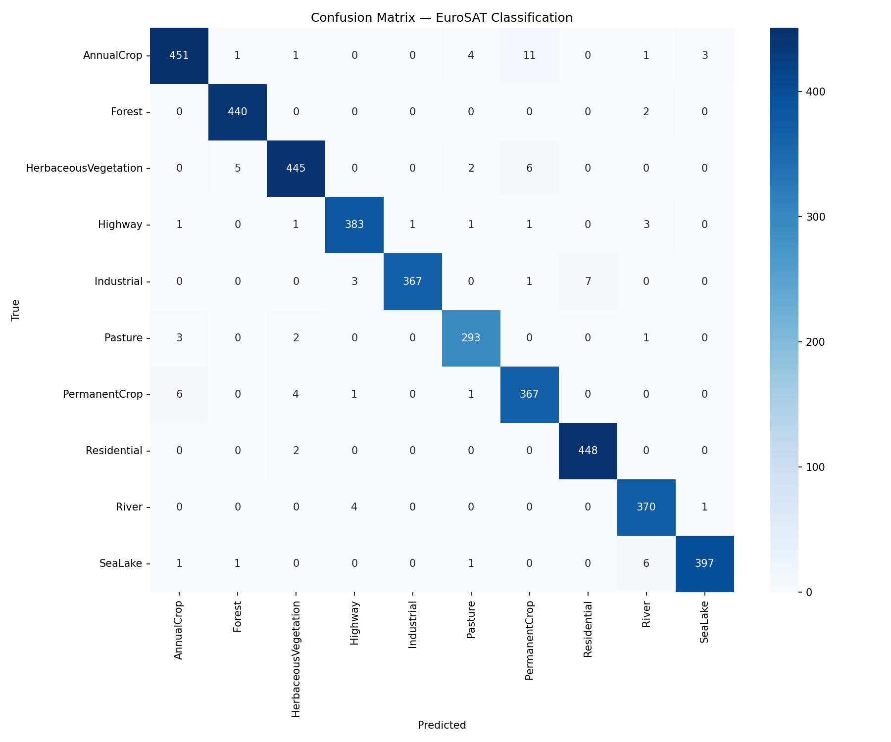
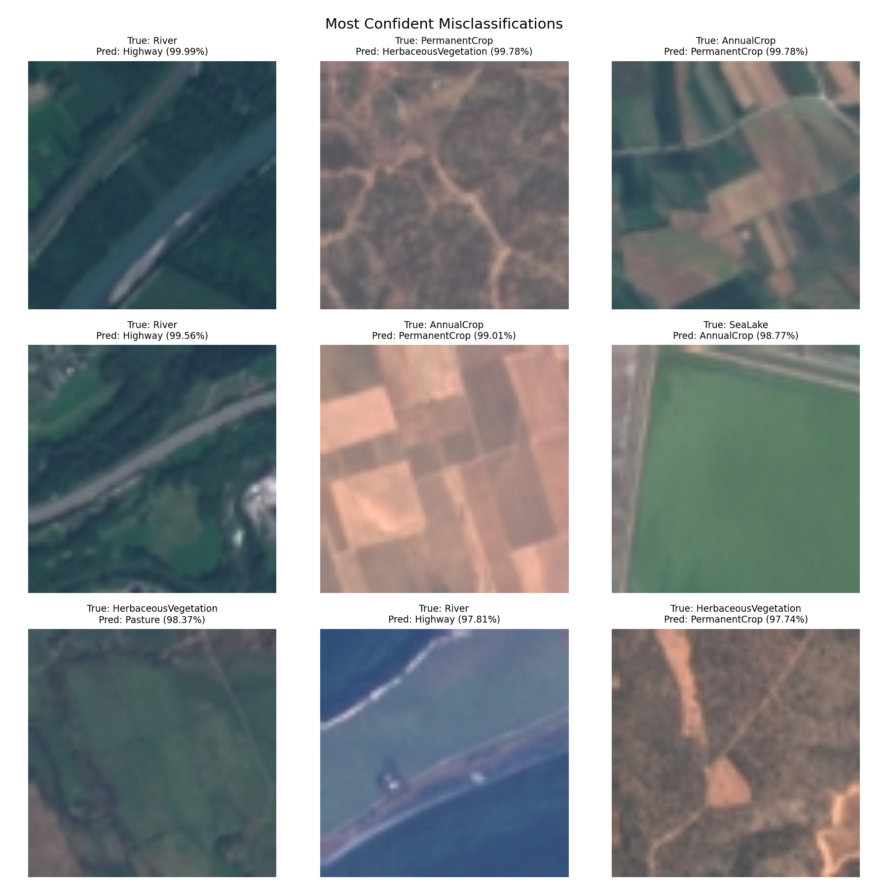

# EuroSAT Land Use Classification with PyTorch

Satellite image classification using transfer learning on the EuroSAT dataset (Sentinel-2 imagery). Fine-tunes a ResNet-18 model pretrained on ImageNet to classify land use into 10 categories.

## Dataset

**EuroSAT** — 27,000 labeled Sentinel-2 satellite images (64x64 pixels, RGB) across 10 land use/land cover classes:

| Class | Samples |
|-------|---------|
| AnnualCrop | 3,000 |
| Forest | 3,000 |
| HerbaceousVegetation | 3,000 |
| Highway | 2,500 |
| Industrial | 2,500 |
| Pasture | 2,000 |
| PermanentCrop | 2,500 |
| Residential | 3,000 |
| River | 2,500 |
| SeaLake | 3,000 |

- **Source**: [EuroSAT GitHub](https://github.com/phelber/eurosat) / [TensorFlow Datasets](https://www.tensorflow.org/datasets/catalog/eurosat)
- **License**: Open access (Helber et al., 2019)
- **Reference**: Helber, P., Bischke, B., Dengel, A., & Borth, D. (2019). EuroSAT: A Novel Dataset and Deep Learning Benchmark for Land Use and Land Cover Classification. IEEE Journal of Selected Topics in Applied Earth Observations and Remote Sensing.

## Project Structure

```
eurosat-classification/
├── src/
│   ├── train.py          # Training script with logging and early stopping
│   ├── evaluate.py       # Evaluation, confusion matrix, error analysis
│   ├── dataset.py        # Dataset loading and preprocessing
│   ├── model.py          # Model definition (ResNet-18 transfer learning)
│   └── utils.py          # Seed setting, logging utilities
├── notebooks/
│   └── exploration.ipynb # Data exploration and visualization
├── outputs/              # Saved models and plots
├── logs/                 # Training logs
├── requirements.txt
├── environment.yml
└── README.md
```

## Setup

```bash
# Clone and install
git clone https://github.com/D-Arslan/eurosat-classification.git
cd eurosat-classification
pip install -r requirements.txt

# Download dataset (auto-downloads via torchvision)
python src/train.py
```

## Training

```bash
python src/train.py --epochs 25 --lr 0.001 --batch-size 64 --seed 42
```

### Key hyperparameters
- **Model**: ResNet-18 (pretrained on ImageNet)
- **Optimizer**: Adam (lr=0.001, weight_decay=1e-4)
- **Scheduler**: ReduceLROnPlateau (patience=3, factor=0.1)
- **Early stopping**: patience=5 on validation loss
- **Batch size**: 64
- **Data augmentation**: RandomHorizontalFlip, RandomVerticalFlip, RandomRotation(15), ColorJitter

## Evaluation

```bash
python src/evaluate.py --checkpoint outputs/best_model.pth
```

Generates:
- Classification report (precision, recall, F1 per class)
- Confusion matrix heatmap
- Misclassified examples with analysis

## Results

Training: 25 epochs on CPU, best model saved at epoch with lowest validation loss (0.0552).

| Metric | Value |
|--------|-------|
| **Test Accuracy** | **97.80%** |
| Macro F1 | 0.9779 |
| Weighted F1 | 0.9780 |
| Best val accuracy | 98.10% |
| Best val loss | 0.0552 |
| Misclassified | 89 / 4,050 |

### Per-class performance

| Class | Precision | Recall | F1-Score | Support |
|-------|-----------|--------|----------|---------|
| AnnualCrop | 0.976 | 0.956 | 0.966 | 472 |
| Forest | 0.984 | 0.996 | 0.990 | 442 |
| HerbaceousVegetation | 0.978 | 0.972 | 0.975 | 458 |
| Highway | 0.980 | 0.980 | 0.980 | 391 |
| Industrial | 0.997 | 0.971 | 0.984 | 378 |
| Pasture | 0.970 | 0.980 | 0.975 | 299 |
| PermanentCrop | 0.951 | 0.968 | 0.960 | 379 |
| Residential | 0.985 | 0.996 | 0.990 | 450 |
| River | 0.966 | 0.987 | 0.976 | 375 |
| SeaLake | 0.990 | 0.978 | 0.984 | 406 |

### Confusion matrix



### Misclassified examples



## Environment

- Python 3.12
- PyTorch 2.x
- CPU (trained without GPU)
- See `requirements.txt` for full dependencies

## Author

**Arslan Aris DIF** — [GitHub](https://github.com/D-Arslan)
